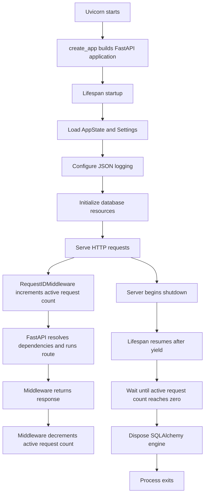

# Milestone 0 — Startup and Shutdown Lifecycle

## Operational notes

- `/health/live` checks only that the API process can answer.
- `/health/ready` checks PostgreSQL connectivity.
- Shutdown waits for in-flight requests before disposing the database engine.
- Alembic migrations run before the container starts Uvicorn through `docker-entrypoint.sh`.
