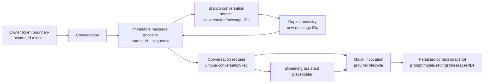

# Milestone 2 — Conversation Domain

## Data flow

1. The owner token is checked before any conversation lookup.
2. A conversation request locks the owned conversation, claims its unique
   idempotency key, and creates the user message plus streaming assistant
   placeholder in one transaction.
3. The service resolves the immutable system prompt, walks the selected parent
   chain, and applies deterministic budgeting.
4. The invocation snapshot is persisted before `GenerationService` opens the
   provider stream.
5. Text chunks update the existing assistant message. Completion, failure, and
   cancellation update both the message and request lifecycle records.
6. Context inspection reads the stored invocation snapshot rather than
   rebuilding context from current registry values.

## Boundaries

The current slice intentionally excludes retrieval, long-term memory,
document/file ingestion, provider-native multimodal requests, queues, and
multi-user authentication. The message-part schema is ready for later work,
but unsupported non-text parts cannot reach the text-only provider request.
