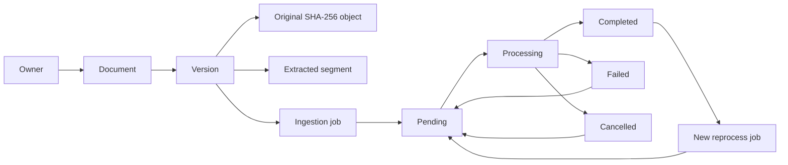

# Milestone 3 — Ingestion State and Provenance

Each segment has an ordinal, optional PDF page, optional Markdown section, and
character offsets into the raw extracted page or decoded source text. The
normalized segment text and full extracted text are database data; the
content-addressed object is the unmodified original upload.
