# Milestone 4 — Retrieval and Citation Flow

```mermaid
flowchart LR
  Owner --> Collection
  Collection --> Membership[Selected documents]
  Membership --> Version[Latest completed version]
  Version --> Segment[Source segment]
  Segment --> Chunker[Fixed or heading aware chunker]
  Chunker --> Embed[Embedding adapter]
  Embed --> Index[Immutable pgvector index]
  Index --> Active[Active pointer]
  Query --> Active
  Active --> Search[Cosine top k search]
  Search --> Evidence[Evidence objects]
  Evidence --> Budget[Context budget]
  Budget --> Answer[Extractive or gateway answer]
  Answer --> Validate[Citation validation]
  Search --> Run[Persisted retrieval run]
  Validate --> Run
  Evidence --> Citation[Owner scoped citation lookup]
```

The active pointer and chunks publish in one transaction. A query pins the
index ID it read, so a concurrent rebuild cannot mix old query vectors with
new chunks. A citation points to a stored chunk and the source version and
segment from which that chunk was built. Historical chunks remain accessible
after a later index becomes active.
